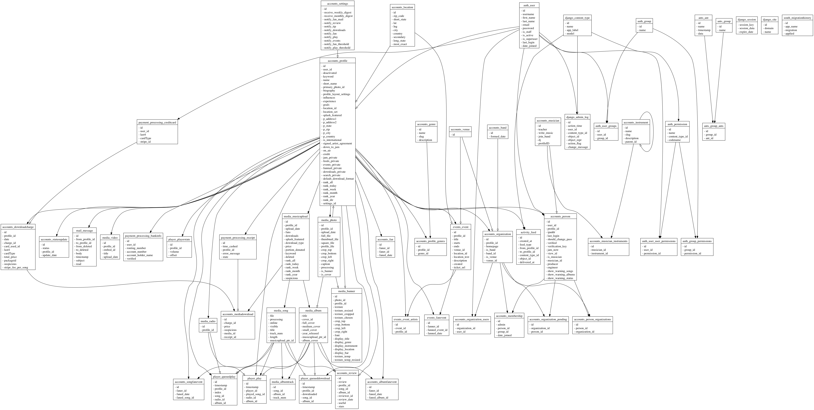

# hearo.fm

the global music marketplace

- [hearo.fm](#hearofm)
  - [Setup](#setup)
    - [Installing a new server](#installing-a-new-server)
    - [Setup env, pull images, and build custom images](#setup-env-pull-images-and-build-custom-images)
    - [Running dev and test setup](#running-dev-and-test-setup)
    - [Building images manually](#building-images-manually)
    - [Media directory](#media-directory)
  - [Running the app once installed](#running-the-app-once-installed)
    - [Dev](#dev)
      - [Running the stack fully within docker](#running-the-stack-fully-within-docker)
      - [Issues with localhost load](#issues-with-localhost-load)
      - [Elasticsearch issues](#elasticsearch-issues)
      - [less files](#less-files)
    - [Setting up a new staging/production machine](#setting-up-a-new-stagingproduction-machine)
    - [Staging and production](#staging-and-production)
  - [The database](#the-database)
    - [Starting with a DB fixture](#starting-with-a-db-fixture)
    - [Starting with a clean slate](#starting-with-a-clean-slate)
    - [Loading sample data](#loading-sample-data)
  - [Rethinkdb](#rethinkdb)
    - [Backup](#backup)
    - [Restore](#restore)
    - [Restore old rethinkdb data (For testing)](#restore-old-rethinkdb-data-for-testing)
  - [Help](#help)
  - [Testing](#testing)
  - [Development](#development)
  - [Schema](#schema)
    - [Generate Graphviz](#generate-graphviz)
    - [Generate using SQLFairy](#generate-using-sqlfairy)
  - [Deployment](#deployment)
  - [Gitlab docker image hosting, testing, and deployment](#gitlab-docker-image-hosting-testing-and-deployment)
  - [Swarm setup](#swarm-setup)
  - [Management commands](#management-commands)
    - [rotate_keys management command](#rotate_keys-management-command)
  - [Emails](#emails)
    - [Sending announcements](#sending-announcements)
  - [Troubleshooting](#troubleshooting)
    - [Audiotools and conversion formats](#audiotools-and-conversion-formats)
    - [hts is not being cloned on a newly setup server](#hts-is-not-being-cloned-on-a-newly-setup-server)
    - [The Django project fails to run](#the-django-project-fails-to-run)
    - [No content is displayed on the main page](#no-content-is-displayed-on-the-main-page)
    - [Importing data into Rethinkdb](#importing-data-into-rethinkdb)
    - [Decrypting private keys downloaded from the wallet](#decrypting-private-keys-downloaded-from-the-wallet)

## Setup

### Installing a new server

Use multiple masters if needed but at the moment, we aren't using swarm to manage child servers. Look at the comments [here](https://stackoverflow.com/questions/48333882/docker-swarm-advertise-addr-changing?rq=1).

To setup a server, (1) create the needed keys and save them to `./creds/prod_creds` using `ssh-key-gen` with no password, (2) copy the `.pub` version of the keys to Gitlab as deployment keys, (3) save them as variables on Gitlab in Base64, variable should be named `SSH_PRIVATE_KEY_BASE64`. (4) Add the prod keys to the server using the command `add_prod_deployment_keys $STAGING_IP` before deployment. (5) Then run `remote setup_server $STAGING_IP`. Replacing the IP as needed.

### Setup env, pull images, and build custom images

The following setups up the environment, builds all images, and creates the
postgresql databases setup with the correct user permissions and databases.

```
# source settings and helper functions
source scripts/init.sh

# create environment secrets
create_secrets
# pull docker images
pull
```

### Running dev and test setup

Setup pyenv 

`brew install pyenv`.

Setup virtual env.

`pyenv virtualenv 3.6.10 hearo-3.6.10`

Setup

```
source scripts/init.sh
create_secrets
pull
run dbs hts
```

Run test suite

`honcho start`

Modifications that you want to store can be saved using 

`DJANGO_SETTINGS_MODULE=settings.test PG_USER=hearo_production PG_HOST=localhost ./manage.py dumpdata app.model > tests/fixtures/fixturename.jsonj`

### Building images manually

Run `build` to build all images.

For dev builds of the `django_app`, you may want to run `build django_app Dockerfile.dev` to build the dev version
which includes python libraries required for development.

### Media directory

The media directory should exist one directory above the hearo project directory.

`mkdir ../media`

## Running the app once installed

### Dev

#### Running the stack fully within docker

Note: Performance is better when the server runs under the host
in which case `honcho start` is the go to command to start a test environment.

For development run:

`run dbs django_app hts`

To run the server once everything is setup, launch a bash shell, cd into the
hearo directory and run the following:

```
source scripts/init.sh
enter
./manage.py runserver 0.0.0.0:8000
```

#### Issues with localhost load

```
pip install -r requirements.txt

or 

pip install -r requirements_dev.txt
```

#### Elasticsearch issues

```
enter
./manage.py rebuild_index
```

to ensure the index is up to date.

#### less files

Install yarn, less, and onchange.

```
brew install yarn
yarn global add less onchange
```

Then run 

`onchange -v "./django_app/static/css/**/*.less" -- lessc --js django_app/static/css/compile.less django_app/static/css/compile.css --source-map django_app/static/css/compile.css.map`

in your project root to monitor for file changes and automatically rebuild them.

You can also add the `django_app/static` folder to the `sources` tab in Chrome under `filesystem sources` to enable live 
editing using source maps.

### Setting up a new staging/production machine

1) Need to add your ssh keys to the remote host, run `remote_install_ssh_keys`
2) Run `remote setup_server $STAGING_IP`. Note: this command needs to be run twice as the first run is a dist upgrade.
3) Run `remote pull $STAGING_IP`
4) Run `remote install_codebase $STAGING_IP`
5) If you have a directory with the correct secrets, run `rsync -av --progress ./docker/secrets/ $SSH_USER@$STAGING_IP:$P_REMOTE_PROJECT_ROOT/docker/secrets`. Otherwise run `create_secrets` to create the secrets on the new machine after logging in.
6) Run `docker swarm init` to create a new swarm manager.
7) Sync the media directories `../media/` and `../mixingbowl/` with production.
8) Sync rethinkdb using `docker run --rm --volumes-from hearo_rethinkdb.1.prg73z2t27916chkizxo0n6u6 -v $(pwd):/backup busybox tar cvf /backup/backup.tar /data` and `docker run --rm --volumes-from ba46c8177171 -v $(pwd):/backup ubuntu bash -c "cd /data && tar xvf /backup/backup.tar --strip 1"`
9) Then run the stack as defined in `scripts/settings.sh` using `./deploy.sh staging`.

### Staging and production

In staging environment ensure you have the correct docker secrets and env files setup.

In a staging/prod environment run:

```
./deploy.sh staging
```

and 

```
deploy.sh production
```

Respectively.

## The database

In dev and staging environment upload restore sample data dump provided.

```
pg_restore hearo_prod dump.sql 
enter
./manage.py migrate
./manage.py rebuild_index
```

### Starting with a DB fixture

If you already have an sql file to load, run the following.

```
pg_restore hearo_prod dump.sql
enter
./manage.py compile_map_stats
./manage.py rebuild_index
```

### Starting with a clean slate

If your not using a db dump to startup.

```
enter
/manage.py syncdb
/manage.py migrate
./manage.py rebuild_index
```

### Loading sample data

Temporarily comment out 'haystack' from INSTALLED_APPS in the Django settings file `settings/base.py`

```
enter
./manage.py loaddata sample_data/data.json
cp -Rf django_app/sample_data/images /media/
./manage.py rebuild_index
./manage.py compile_map_stats
```

## Rethinkdb

### Backup
    
`docker cp hearo_rethinkdb:/data - > rethinkdbbackup.tar`

### Restore

`docker cp - hearo_rethinkdb:/ < rethinkdbbackup.tar`

### Restore old rethinkdb data (For testing)

To restore data from production, you need to sync the upgrade_rethinkdb.tar.gz file
from the Hearo production rethinkdb server, extract the folder under django_app/
then run the scripts under /bin:

```
python bin/init_rethinkdb.py
python bin/import_rethinkdb.py
```

## Help

You can run `help` in the console to get the available helper commands.

## Testing

`DJANGO_SETTINGS_MODULE=settings.test ./manage.py test --keepdb --ipdb-failures --nocapture --ipdb --failfast moduletotest`

## Development

Django extensions also provides some tools to assist in development.

## Schema



### Generate Graphviz

Run a command to generate the schema.

`./manage.py graph_models -g -a --pygraphviz -o schema.png`

### Generate using SQLFairy

Generated using [SQLFairy](http://sqlfairy.sourceforge.net).

When updating the database, generate the current schema and use sqlfairy to
update the visualisation.

You need to use Mysql or Postgres as the database type when creating the
database to display relationships within the database (Django < 1.7 doesn't generate
foreign keys for Sqlite).

Run the following to generate the schema:

`sqlt-graph -f MySQL -o docs/schema.png -t png database.sql`

## Deployment

Security is based on giving the minimal permissions to a process. You should
fully understand Unix basic user/group/permission system, if you don't here's a [unix permissions crash course](http://blog.yourlabs.org/post/19240900759/survive-linux-nix-permissions>). 

System administration is based on shell scripting. You should understand shell
scripting fully before even considering adding a layer on top of it. If you
don't know how to do something in bash, and are already thinking of using an
abstraction layer then you're doing it wrong. Shell scripting have been the
standard way of administrating unix servers for decades.  You should understand
how to use your shell as an interactive framework. If you don't, here's a
[shell scripting crash course](http://blog.yourlabs.org/post/75538698021/bash-interactive-scripting-basics>).

## Gitlab docker image hosting, testing, and deployment

Install gitlab-runner. Run the following on prod (Update paths for dev):

```
docker run -d --name gitlab-runner --restart always \
     -v /srv/gitlab-runner/config:/etc/gitlab-runner \
     -v /var/run/docker.sock:/var/run/docker.sock \
     gitlab/gitlab-runner:latest
```

Then run the following if you'd like to register the runner with gitlab:

`docker exec -it gitlab-runner gitlab-runner register`

Then edit the config file generated (`/srv/gitlab-runner/config/config.toml`) setting `privaledged` to true
and restart the service using `docker exec -it gitlab-runner gitlab-runner restart`.

## Swarm setup

On the leader:

```
docker swarm init
```

On managers or workers:

```
docker swarm join <token>
```

On the leader:

```
docker node update <instance-id> --label-add instance_type=leader
```

On the followers:

```
docker node update <instance-id> --label-add instance_type=follower

```

On the db master:

```
docker node update <instance-id> --label-add db_role=leader
```

On the db follower:

```
docker node update <instance-id> --label-add db_role=follower
```

List nodes with labels

`docker node ls -q | xargs docker node inspect -f '{{ .ID }} [{{ .Description.Hostname }}]: {{ .Spec.Labels }}'`

## Management commands

Overview of important management commands:

```
[accounts]
    enable_south

[activity]
    deliver_notifications   - Deliver notifications
    monthly_digest - Create monthly digest notificatons
    weekly_digest - Create weekly digest notificatons
    yearly_digest - Create yearly digtest notifications

[auth]
    changepassword
    createsuperuser

[compressor]
    compress - Compress static assets
    mtime_cache

[django]
    cleanup
    compilemessages
    createcachetable
    dbshell
    diffsettings
    dumpdata
    flush
    inspectdb
    loaddata
    makemessages
    reset
    runfcgi
    shell
    sql
    sqlall
    sqlclear
    sqlcustom
    sqlflush
    sqlindexes
    sqlinitialdata
    sqlreset
    sqlsequencereset
    startapp
    startproject
    validate

[django_socketio]
    runserver_socketio

[haystack]
    build_solr_schema 
    clear_index
    haystack_info
    rebuild_index - Rebuild the elasticsearch index
    update_index - Update the index

[kronos]
    installtasks
    runtask
    uninstalltasks

[payment_processing]
    create_transmittal_record   - Create the ACH file that will be sent to the bank
    pay_artists - Find artists who need to be paid.  Create receipts for them, then transmit the ACH payments to the bank

[south]
    convert_to_south
    datamigration
    graphmigrations
    migrate
    migrationcheck
    schemamigration
    startmigration
    syncdb
    test
    testserver

[staticfiles]
    collectstatic - Compile assets
    findstatic  - Finds a particular static file
    runserver

[worldmap]
    compile_map_stats - Compiles stats required for the world map
```

### rotate_keys management command

This rotates keys used for wallet recovery. To update the keys, update the `settings/keys.py` file with new public keys.

You can find your public and private keys by going to the admin and clicking 'Download my openpgp private keys'.

You'll need to have copies of their old private keys (Public keys of which were in `settings/keys.py` prior to update) to use the key rotation command.

`./manage.py ./keyfile1.asc ./keyfile2.asc`

The console will prompt your for the passwords that will be required to decrypt the private keys used in the
creation of recovery wallets.

To see how many wallets are affected before updating the recovery wallets, pass the `--count` argument.

`./manage.py ./keyfile1.asc ./keyfile2.asc --count`

You can upload the keys to the server using the following command from the shell: 

`copy_to_remote ./file.asc $SWARM_LEADER`

Then remove the private key files once you've finished key rotation using `srm ./file.asc`. 

That performs a secure removal of the file.

## Emails

### Sending announcements

If your settings are configured with sendgrid, you can send emails to a list of
users using the following

`python announce.py email listofemails.csv`

The email needs to exist under
`/templates/emails_announcements/<email>.html`.

Images need to exist under the static media folder and need to be uploaded to
master.

You can add a url for the announcement, just add to the bottom of `urls.py`:

```
url(r'^email_announcements/<email>', ExtraContextTemplateView.as_view(template_name='email_announcements/<email.html')),
```

## Troubleshooting

### Audiotools and conversion formats

The current Dockerfile is setup for the following `audiotools-config`.

```
extraction arguments
  Format Readable Writable Default Quality
  ────── ──────── ──────── ───────────────
    aiff      yes      yes
    alac      yes      yes
      au      yes      yes
    flac      yes      yes               8
     m4a       no       no             100
     mp2       no       no             192
     mp3       no       no               2
     ogg       no       no               3
    opus       no       no              10
     tta      yes      yes
     wav      yes      yes
      wv       no       no        standard
```

To install other translation formats refer to the following:

```
Audio tools related=============================================================================================
Python Audio Tools 3.1.1 Setup
=============================================================================================
     library present? used for                           download URL
------------ -------- ---------------------------------- ------------------------------------
  libasound2 no       ALSA output                        http://www.alsa-project.org
     libcdio no       CDDA data extraction               http://www.gnu.org/software/libcdio/
libdvd-audio no       DVD-Audio extraction               http://libdvd-audio.sourceforge.net
   libmpg123 no       MP3/MP2 decoding                   http://www.mpg123.org
    libpulse no       PulseAudio output                  http://www.freedesktop.org
     mp3lame no       MP3 encoding                       http://lame.sourceforge.net
        opus no       Opus encoding                      http://www.opus-codec.org
    opusfile no       Opus decoding                      http://www.opus-codec.org
     twolame no       MP2 encoding                       http://twolame.sourceforge.net
   vorbisenc no       Ogg Vorbis encoding                http://www.xiph.org
  vorbisfile no       Ogg Vorbis decoding                http://xiph.org
     wavpack no       Wavpack decoding, Wavpack encoding http://www.wavpack.co
```


### hts is not being cloned on a newly setup server

We need to switch the deployment process to using Gitlab deployment keys but until then
we are using deploy tokens. When submodules are updated however it uses the deploy
tokens for the current hearo project instead of hts, hence the .git/config
file needs to be updated on each server that uses the hts service.

Open .git/config and edit the hts submodule line to use the deploy
token and pass from the gitlab hts project.

Refer to https://docs.gitlab.com/ee/ci/ssh_keys/ and look into how we use the GITLAB_DEPLOY_TOKENs
in settings and throughout the deployment files to eventually fix the issue.

### The Django project fails to run

Run `pip install -r requirements.txt` or run `pull` in the command line
to get the latest images since this is probably a dependencies issue.

### No content is displayed on the main page

Run `./manage.py rebuild_index`.

### Importing data into Rethinkdb

If you have a full backup of the the hearo production rethinkdb
data folders, you can perform an import.

Ensure that a folder exists, `django_app/upgrade_rethinkdb/`.

Run the dbs stack using `run dbs`.

The rethinkdb stack file will assume the directory exists.

To initialize the database, run:

```
enter django_app
cd bin
python init_rethinkdb.py
python import_rethinkdb.py
```

### Decrypting private keys downloaded from the wallet

```
gpg --import  dnordberg@gmail.com_2021-07-26.asc
gpg -d dnordberg@gmail.com_2021-07-26_hedera_private_key.msg
```
